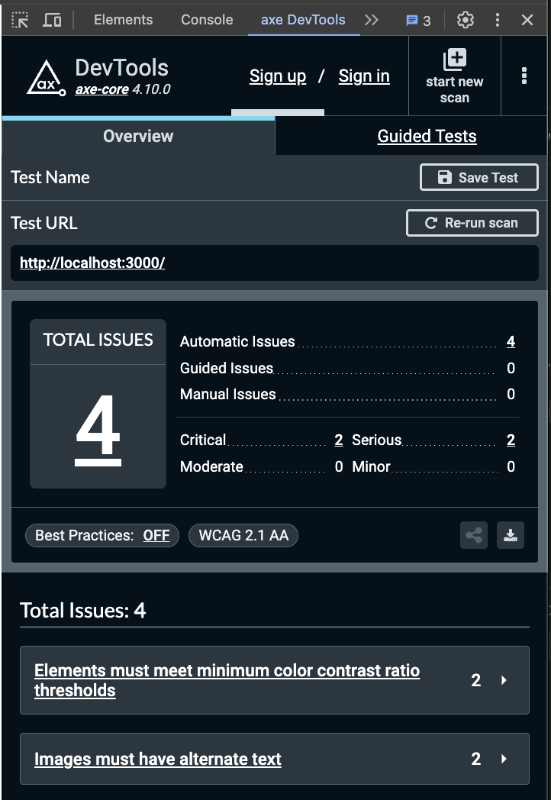

# Otaniemi Fight Club landing page

## Running the app in Docker

Create the required `.env` files at the root of the project, in the `strapi`folder and in the `frontend` folder.

Make sure you have Docker Compose installed and run

```shell
docker-compose up
```

The frontend client is available at <a href="http://localhost:3000/" target="_blank">http://localhost:3000/</a>

Log into the Strapi admin panel at <a href="http://localhost:1337/admin" target="_blank">http://localhost:1337/admin</a>

## Local Strapi development

When creating new Collection or Single types or specifying Strapi settings, first run the Postgres (e.g. with `docker-compose up`)

And then stop the possibly running Strapi container running in port 1337.

Instead run `npm run strapi develop` inside `strapi` folder. This ensures that new Collection and Single type schema files are saved within the repository.

> **Warning**
> COLLECTION AND SINGLE TYPE ENTRIES (e.g. any collection members created in Strapi) ARE STORED ONLY LOCALLY!

## Testing

Enable the <a href="https://chromewebstore.google.com/detail/axe-devtools-web-accessib/lhdoppojpmngadmnindnejefpokejbdd?utm_source=deque.com&utm_medium=referral&utm_campaign=axe-browser-extensions_hero&pli=1" target="_blank">axe DevTools Chrome extension</a> when developing the frontend.

Open the axe DevTools tab in Chrome DevTools and run the _Full Page Scan_ to check for accessibility issues to fix them accordingly.



## Code formatting

Format code according to rules specified in `.prettierrc` by running

```shell
npx prettier . --write
```

You can also install the <a href="https://marketplace.visualstudio.com/items?itemName=esbenp.prettier-vscode" target="_blank">Prettier VSCode extension</a> to format code on save
